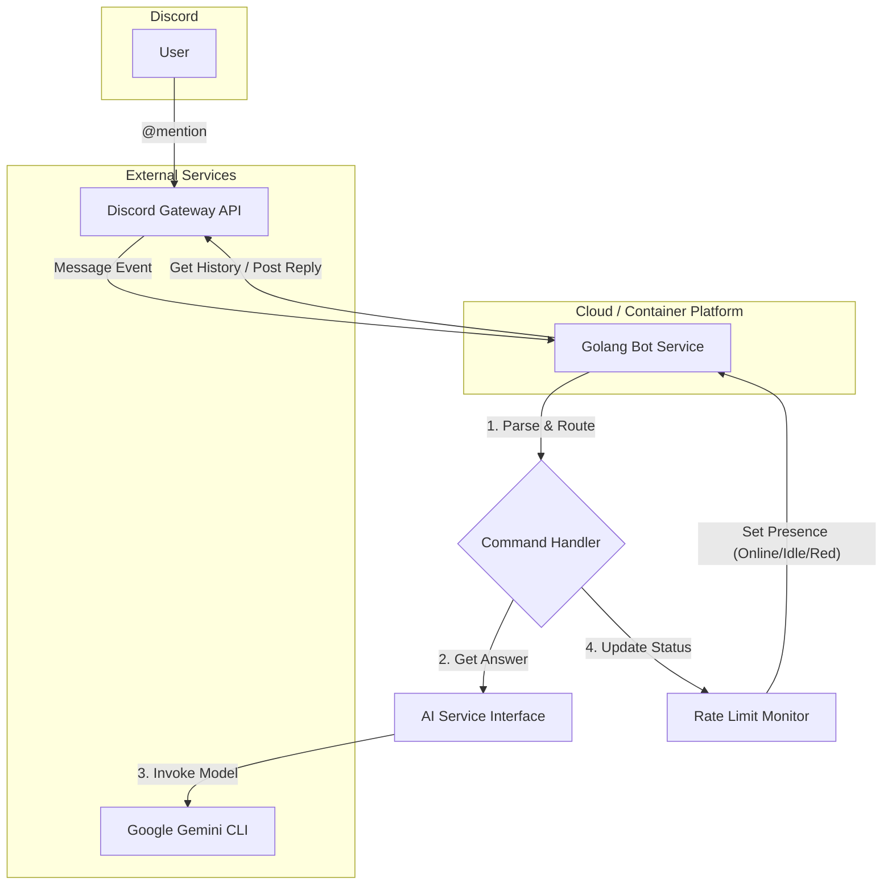

# BMAD Knowledge Bot Architecture Document

## Introduction

[cite\_start]This document outlines the overall project architecture for the BMAD Knowledge Bot. [cite: 635] [cite\_start]Its primary goal is to serve as the guiding architectural blueprint for AI-driven development, ensuring consistency and adherence to chosen patterns and technologies. [cite: 637] This architecture is designed to satisfy all functional and non-functional requirements detailed in the PRD, with a focus on a Golang backend, Docker containerization, and a decoupled AI service layer.

### Starter Template or Existing Project

[cite\_start]N/A - This is a greenfield project that will be built from scratch following the patterns outlined in this document. [cite: 642]

### Change Log

| Date | Version | Description | Author |
| :--- | :------ | :---------- | :----- |
| 2025-06-28 | 1.0 | Initial architecture draft | Winston, Architect |

## High Level Architecture

### Technical Summary

The system is a monolithic Golang service that connects to the Discord Gateway API. It listens for mentions, processes queries using a decoupled service that invokes the Google Gemini CLI, and manages conversational context within Discord threads. The application is designed to be containerized with Docker for portability and deployment. A key feature is a background monitoring service that tracks API usage and dynamically updates the bot's public-facing status on Discord.

### High Level Overview

[cite\_start]The architecture is a **Monolithic Service** contained within a **Polyrepo**. [cite: 421] This approach provides simplicity for the initial MVP development. The bot's main loop will listen for Discord events. When a user mentions the bot, a command handler will parse the query. This handler will interact with a dedicated, decoupled AI service to fetch an answer. The bot will then create or continue a conversation in a Discord thread. Concurrently, a background process will monitor Gemini API usage and update the bot's status, providing a simple, passive health check to users.

### High Level Project Diagram



### Architectural and Design Patterns

  * [cite\_start]**Monolithic Service**: The entire application will run as a single process. [cite: 421]
      * *Rationale*: This simplifies development, testing, and deployment for the MVP scope.
  * **Decoupled AI Service Layer**: All interactions with the Gemini model will be abstracted behind a Go interface (`AIService`). [cite\_start]The initial implementation will call the Gemini CLI. [cite: 421]
      * *Rationale*: This fulfills NFR3 from the PRD, allowing for future flexibility to switch to a direct API client or different AI model without refactoring the core bot logic.
  * **Background Worker (Goroutine)**: A concurrent goroutine will be used for the Rate Limit Monitor.
      * *Rationale*: This is a standard, efficient Go pattern for running background tasks like health monitoring without blocking the main application logic (i.e., responding to user messages).

## Tech Stack

This table represents the definitive technology selection for the project.

| Category | Technology | Version | Purpose | Rationale |
| :--- | :--- | :--- | :--- | :--- |
| **Language** | Golang | 1.24.x | Backend Service Development | Fulfills PRD requirement (NFR2); excellent for concurrent, performant services. |
| **Discord Library** | discordgo | v0.28.x | Discord Gateway API Interaction | A popular and well-maintained library for building Discord bots in Go. |
| **Cache** | go-cache | v2.1.x | In-memory API Rate Counter | Provides a simple, thread-safe in-memory cache perfect for the rate limit monitor. |
| **Testing** | Go Test | 1.24.x | Unit & Integration Testing | Built-in to the Go toolchain; provides a robust testing framework. |
| **Build Tool** | Go Toolchain | 1.24.x | Compiling the application | The standard, built-in build system for Go. |
| **IaC / Runtime** | Docker | 26.x | Containerization | Fulfills PRD requirement (NFR3) for portable and scalable deployment. |
| **Logging** | slog | 1.24.x | Structured Logging | The official structured logging package in Go's standard library. |

## Data Models

No persistent database is required for the MVP. The following structs will be used to manage application state in memory.

### RateLimitState

**Purpose**: To hold the current state of the API usage counter.

```go
// RateLimitState tracks API call counts over a specific window.
type RateLimitState struct {
    Calls       []time.Time // Stores timestamps of recent calls
    Mutex       sync.Mutex
    Window      time.Duration // e.g., 1 minute
    Limit       int           // e.g., 60 calls per minute
}
```

## Components

The monolithic service will be internally structured into these logical components:

1.  **Discord Session Manager**: Handles the primary connection to the Discord Gateway, manages the bot's lifecycle, and registers event handlers.
2.  **Interaction Handler**: A function or set of functions that trigger on Discord message events. It will parse the message content, identify mentions, and route the request to the appropriate service.
3.  **AIService Interface**: A Go interface defining the contract for getting answers from an AI model. This enforces the decoupled design.
4.  **GeminiCLIService**: The concrete implementation of the `AIService` interface. This component will be responsible for constructing the correct prompt, executing the `gemini-cli` command, and parsing its output.
5.  **RateLimitMonitor**: A background service running in a separate goroutine. It periodically checks the `RateLimitState` and calls the Discord Session Manager to update the bot's public presence (status).
6.  **ThreadManager**: A component responsible for creating new threads or finding existing ones to post replies in.

## External APIs

  * **Discord Gateway API**: The primary real-time API used to receive events (like messages) from and send commands (like posting replies or changing status) to Discord.
  * **Google Gemini CLI**: The command-line tool used as the initial implementation for the AI service. The application will treat this as an external dependency, executing it as a sub-process.

## REST API Spec

Not applicable. The service interacts with Discord via its real-time Gateway API, not a public-facing REST API.

## Database Schema

Not applicable for the MVP, as no persistent database is required.

## Source Tree

The project will follow a standard Golang service layout.

```plaintext
bmad-knowledge-bot/
├── cmd/
│   └── bot/
│       └── main.go         # Main application entry point
├── internal/
│   ├── bot/                # Core bot logic, event handlers
│   │   ├── handler.go
│   │   └── session.go
│   ├── service/
│   │   ├── ai_interface.go # The AIService interface definition
│   │   └── gemini_cli.go   # The CLI implementation of the service
│   └── monitor/
│       └── ratelimiter.go  # The rate limit monitoring service
├── .env.example            # Template for environment variables
├── .gitignore
├── go.mod                  # Go module definition
├── go.sum
├── Dockerfile              # Instructions to build the container image
└── README.md
```

## Infrastructure and Deployment

### Infrastructure as Code

A `Dockerfile` will be the primary IaC artifact, defining the application's runtime environment. For local development, a `docker-compose.yml` file can be added to simplify running the container and managing environment variables.

### Deployment Strategy

The application will be deployed as a single Docker container. This container can be run on any cloud provider's container service, such as Google Cloud Run, AWS ECS, or DigitalOcean App Platform. The strategy is to simply stop the old container and start the new one on deployment.

### Environments

  * **Local**: Developers run the container on their local machine using Docker Desktop.
  * **Production**: A single container running on a cloud provider.

### Rollback Strategy

Rollback is achieved by re-deploying the previously known-good Docker image tag.

## Error Handling Strategy

  * Structured logging using Go's `slog` package will be implemented globally.
  * All errors returned from services will be logged with context (e.g., the Discord channel/user that triggered the request).
  * The `AIService` will have specific, typed errors for scenarios like "CLI command failed" or "no output from model" to allow the bot to respond with a helpful message (e.g., "Sorry, I'm having trouble thinking right now.") instead of crashing.
  * The application will be configured to perform a graceful shutdown, ensuring it disconnects cleanly from the Discord Gateway on a fatal error.

## Coding Standards

  * All code must be formatted with `gofmt`.
  * Standard Go linting rules will be applied.
  * **Critical Rule**: All business logic for interacting with the Gemini model **MUST** be implemented via the `AIService` interface. No direct calls to the `gemini-cli` command should exist outside of the `GeminiCLIService` implementation.
  * Secrets (Bot Token, API Keys) must only be read from environment variables at startup. Do not hardcode them.

## Test Strategy

  * **Unit Tests**: All core business logic within the services (e.g., text summarization for prompts, rate limit calculation) and helper functions will be unit tested using Go's standard testing package. Mocks will be used for external dependencies like the Discord API.
  * **Integration Tests**: A small suite of integration tests will validate the bot's ability to handle a simulated Discord message event, call the `AIService`, and prepare a reply. These tests will run against a mocked Discord Gateway and a stubbed version of the Gemini CLI.

## Security

  * **Secrets Management**: The Discord Bot Token and any Google Cloud/Gemini API keys will be managed via environment variables, passed securely to the Docker container at runtime. They will never be checked into source control.
  * **Input Sanitization**: While the risk is low, any user-provided text that is used to construct a command-line argument for the Gemini CLI will be properly escaped to prevent potential command injection vulnerabilities.