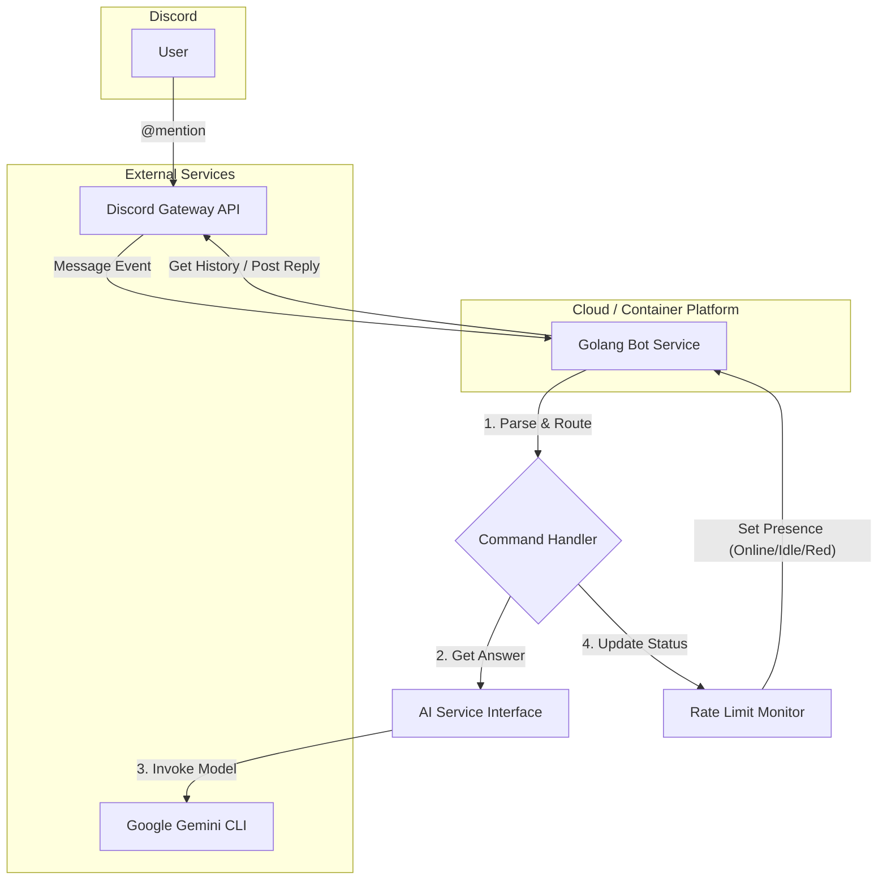

# High Level Architecture

## Technical Summary

The system is a monolithic Golang service that connects to the Discord Gateway API. It listens for mentions, processes queries using a decoupled service that invokes the Google Gemini CLI, and manages conversational context within Discord threads. The application is designed to be containerized with Docker for portability and deployment. A key feature is a background monitoring service that tracks API usage and dynamically updates the bot's public-facing status on Discord.

## High Level Overview

[cite\_start]The architecture is a **Monolithic Service** contained within a **Polyrepo**. [cite: 421] This approach provides simplicity for the initial MVP development. The bot's main loop will listen for Discord events. When a user mentions the bot, a command handler will parse the query. This handler will interact with a dedicated, decoupled AI service to fetch an answer. The bot will then create or continue a conversation in a Discord thread. Concurrently, a background process will monitor Gemini API usage and update the bot's status, providing a simple, passive health check to users.

## High Level Project Diagram

## Architectural and Design Patterns

  * [cite\_start]**Monolithic Service**: The entire application will run as a single process. [cite: 421]
      * *Rationale*: This simplifies development, testing, and deployment for the MVP scope.
  * **Decoupled AI Service Layer**: All interactions with the Gemini model will be abstracted behind a Go interface (`AIService`). [cite\_start]The initial implementation will call the Gemini CLI. [cite: 421]
      * *Rationale*: This fulfills NFR3 from the PRD, allowing for future flexibility to switch to a direct API client or different AI model without refactoring the core bot logic.
  * **Background Worker (Goroutine)**: A concurrent goroutine will be used for the Rate Limit Monitor.
      * *Rationale*: This is a standard, efficient Go pattern for running background tasks like health monitoring without blocking the main application logic (i.e., responding to user messages).